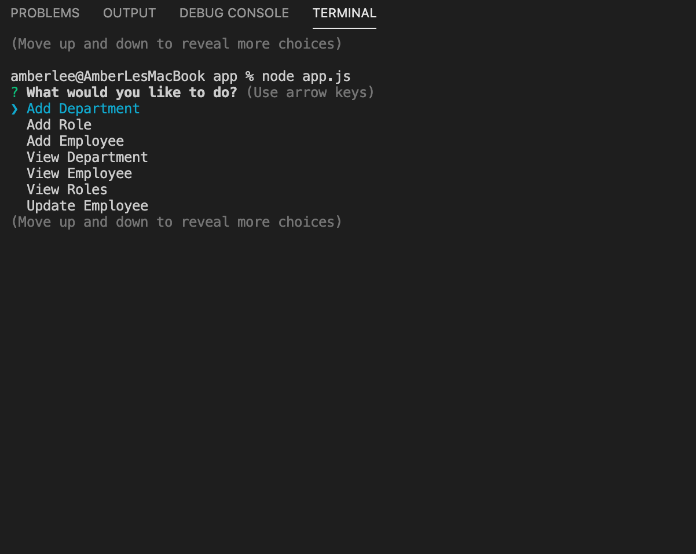

# Employee Tracker

[](https://opensource.org/licenses/MIT)
      
     
## Description

A database for managing a company's employees.  This app solves the problem of having to keep paper records for each employee.  Technologies used: Node.js, Express, Inquirer.

## Table of Contents
 
* [Installation](#installation)
* [Usage](#usage)
* [License](#license)
 
## Installation
```
npm i MySQL, inquirer and  dotenv.
``` 

## Usage
Watch the Employee Tracker demo [here.](https://vimeo.com/486627321/420ccdfb0e)  

Access the project repository [here.](https://github.com/lee-amber-alex/Employee.Tracker)  



## License
This project is covered under the MIT License.
 
## Questions
- [Email](lee.amber.alex@gmail.com)
- [Github Page](https://github.com/lee-amber-alex)
 
